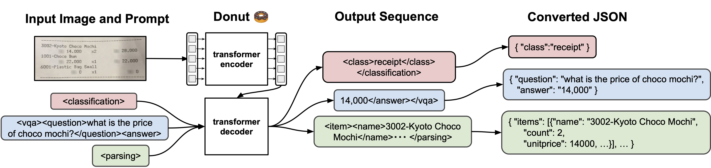

<div align="center">

# Donut 🍩-hole : Optimized Document Understanding Transformer

[](https://arxiv.org/abs/2111.15664)
[](#how-to-cite)
[](https://pypi.org/project/donut-python)
[](https://opensource.org/licenses/MIT)

**DONUT-hole** is an optimized variant of DONUT 🍩, featuring model compression through **magnitude-based pruning**, **knowledge distillation**, and **adapter bottlenecks** for efficient document understanding.

Official Implementation of Donut and SynthDoG | [Paper](https://arxiv.org/abs/2111.15664) | [Slide](https://docs.google.com/presentation/d/1gv3A7t4xpwwNdpxV_yeHzEOMy-exJCAz6AlAI9O5fS8/edit?usp=sharing) | [Poster](https://docs.google.com/presentation/d/1m1f8BbAm5vxPcqynn_MbFfmQAlHQIR5G72-hQUFS2sk/edit?usp=sharing)

</div>

## Introduction

**DONUT-hole** 🍩-hole builds upon the original DONUT (DOcumeNt Understanding Transformer), an OCR-free end-to-end Transformer model for document understanding. DONUT-hole introduces several optimization techniques to reduce model size and computational requirements while maintaining performance:

- **Magnitude-based Pruning**: Removes less important weights to achieve target sparsity levels
- **Knowledge Distillation**: Transfers knowledge from a larger teacher model to a smaller student model
- **Adapter Bottlenecks**: Adds lightweight adapter layers between encoder and decoder for parameter-efficient fine-tuning

The implementation supports multiple model variants optimized for different use cases and computational constraints.



## Model Variants

DONUT-hole provides several optimized model variants:

### DONUT-base
- **Architecture**: Full DONUT-base with [2,2,14,2] encoder layers and 4 decoder layers
- **Input Size**: 2560×1920
- **Parameters**: ~220M (unpruned)
- **Use Case**: Baseline performance, full capability

### DONUT-small
- **Architecture**: Reduced encoder [2,2,6,2] layers and 2 decoder layers
- **Input Size**: 1280×960
- **Parameters**: ~55M
- **Use Case**: Resource-constrained environments, faster inference

### DONUT-hole
- **Architecture**: Full DONUT-base with adapter bottleneck
- **Pruning**: 30% magnitude-based pruning
- **Distillation**: Knowledge distillation from DONUT-base teacher
- **Parameters**: ~154M effective (70% of original)
- **Use Case**: Balanced performance-efficiency tradeoff

### DONUT-base-pruned
- **Architecture**: Full DONUT-base without adapters
- **Pruning**: 50% magnitude-based pruning
- **Parameters**: ~110M effective (50% of original)
- **Use Case**: Maximum compression with minimal architecture changes

## Software Installation

### Requirements
- Python >= 3.7
- PyTorch >= 1.11.0
- CUDA-compatible GPU (recommended for training)

### Installation

```bash
# Clone the repository
git clone https://github.com/clovaai/donut.git
cd donut-hole/

# Install dependencies
pip install -r requirements.txt

# Or install as package
pip install -e .
```

### Dependencies
```txt
transformers>=4.11.3
timm
datasets[vision]
pytorch-lightning>=1.6.4
nltk
sentencepiece
zss
sconf>=0.2.3
```

## Getting Started

### Data Preparation

DONUT-hole uses the same data format as the original DONUT. Prepare your dataset in the following structure:

```bash
dataset_name/
├── train/
│   ├── metadata.jsonl
│   └── images/
├── validation/
│   ├── metadata.jsonl
│   └── images/
└── test/
    ├── metadata.jsonl
    └── images/
```

Each `metadata.jsonl` file contains lines in JSON Lines format:
```json
{"file_name": "images/receipt_001.jpg", "ground_truth": "{\"gt_parse\": {\"menu\": [{\"nm\": \"Coffee\", \"price\": \"3.50\"}]}}"}
```

### Supported Tasks

1. **Document Information Extraction** (e.g., CORD, Train Ticket)
   - Ground truth: `{"gt_parse": {"field1": "value1", "field2": "value2"}}`

2. **Document Classification** (e.g., RVL-CDIP)
   - Ground truth: `{"gt_parse": {"class": "invoice"}}`

3. **Document Visual Question Answering** (e.g., DocVQA)
   - Ground truth: `{"gt_parses": [{"question": "What is the total?", "answer": "25.00"}]}`

## Training

### Training Commands

#### 1. DONUT-base (Baseline)
```bash
python train.py \
    --config config/train_cord.yaml \
    --pretrained_model_name_or_path "naver-clova-ix/donut-base" \
    --dataset_name_or_paths '["naver-clova-ix/cord-v2"]' \
    --exp_version "donut_base_cord" \
    --model_config config/model_donut_base.yaml
```

#### 2. DONUT-small (Compressed Architecture)
```bash
python train.py \
    --config config/train_cord.yaml \
    --pretrained_model_name_or_path "naver-clova-ix/donut-base" \
    --dataset_name_or_paths '["naver-clova-ix/cord-v2"]' \
    --exp_version "donut_small_cord" \
    --model_config config/model_donut_small.yaml \
    --teacher_model_path "naver-clova-ix/donut-base" \
    --distillation_temperature 2.0 \
    --distillation_alpha 0.5
```

#### 3. DONUT-hole (Pruning + Distillation)
```bash
python train.py \
    --config config/train_cord.yaml \
    --pretrained_model_name_or_path "naver-clova-ix/donut-base" \
    --dataset_name_or_paths '["naver-clova-ix/cord-v2"]' \
    --exp_version "donut_hole_cord" \
    --model_config config/model_donut_hole.yaml \
    --teacher_model_path "naver-clova-ix/donut-base" \
    --pruning_sparsity 0.3 \
    --distillation_temperature 2.0 \
    --distillation_alpha 0.7
```

#### 4. DONUT-base-pruned (High Compression)
```bash
python train.py \
    --config config/train_cord.yaml \
    --pretrained_model_name_or_path "naver-clova-ix/donut-base" \
    --dataset_name_or_paths '["naver-clova-ix/cord-v2"]' \
    --exp_version "donut_base_pruned_cord" \
    --model_config config/model_donut_base_pruned.yaml \
    --pruning_sparsity 0.5
```

### Training Configurations

#### CORD (Receipt Understanding)
```yaml
# config/train_cord.yaml
resume_from_checkpoint_path: null
result_path: "./result"
pretrained_model_name_or_path: "naver-clova-ix/donut-base"
dataset_name_or_paths: ["naver-clova-ix/cord-v2"]
sort_json_key: false
train_batch_sizes: [8]
val_batch_sizes: [1]
input_size: [1280, 960]
max_length: 768
align_long_axis: false
num_nodes: 1
seed: 2022
lr: 3e-5
warmup_steps: 300
num_training_samples_per_epoch: 800
max_epochs: 30
max_steps: -1
num_workers: 8
val_check_interval: 1.0
check_val_every_n_epoch: 3
gradient_clip_val: 1.0
verbose: true
```

#### DocVQA (Document VQA)
```yaml
# config/train_docvqa.yaml
resume_from_checkpoint_path: null
result_path: "./result"
pretrained_model_name_or_path: "naver-clova-ix/donut-base"
dataset_name_or_paths: ["naver-clova-ix/docvqa"]
sort_json_key: false
train_batch_sizes: [4]
val_batch_sizes: [1]
input_size: [1280, 960]
max_length: 768
align_long_axis: false
num_nodes: 1
seed: 2022
lr: 3e-5
warmup_steps: 300
num_training_samples_per_epoch: 10000
max_epochs: 10
max_steps: -1
num_workers: 8
val_check_interval: 1.0
check_val_every_n_epoch: 1
gradient_clip_val: 1.0
verbose: true
```

#### RVL-CDIP (Document Classification)
```yaml
# config/train_rvlcdip.yaml
resume_from_checkpoint_path: null
result_path: "./result"
pretrained_model_name_or_path: "naver-clova-ix/donut-base"
dataset_name_or_paths: ["rvl_cdip"]
sort_json_key: false
train_batch_sizes: [16]
val_batch_sizes: [1]
input_size: [1280, 960]
max_length: 768
align_long_axis: false
num_nodes: 1
seed: 2022
lr: 3e-5
warmup_steps: 300
num_training_samples_per_epoch: 320000
max_epochs: 5
max_steps: -1
num_workers: 8
val_check_interval: 1.0
check_val_every_n_epoch: 1
gradient_clip_val: 1.0
verbose: true
```

### Multi-Task Training
```bash
python train.py \
    --config config/train_cord.yaml \
    --pretrained_model_name_or_path "naver-clova-ix/donut-base" \
    --dataset_name_or_paths '["naver-clova-ix/cord-v2", "naver-clova-ix/docvqa"]' \
    --task_start_tokens '["<s_cord>", "<s_docvqa>"]' \
    --exp_version "multitask_training" \
    --model_config config/model_donut_hole.yaml
```

## Evaluation

### Testing Commands

#### Single Dataset Evaluation
```bash
python test.py \
    --pretrained_model_name_or_path ./result/train_cord/donut_hole_cord \
    --dataset_name_or_path naver-clova-ix/cord-v2 \
    --split test \
    --task_name cord \
    --save_path ./result/test_results.json
```

#### Custom Dataset Evaluation
```bash
python test.py \
    --pretrained_model_name_or_path ./result/train_cord/donut_hole_cord \
    --dataset_name_or_path /path/to/custom/dataset \
    --split test \
    --task_name cord \
    --save_path ./result/custom_test_results.json
```

### Evaluation Metrics

- **Tree Edit Distance (TED)**: Measures structural similarity between predicted and ground truth JSON
- **F1 Score**: Token-level F1 score for information extraction tasks
- **Accuracy**: Exact match accuracy for classification and VQA tasks

### Sparsity Monitoring
```python
from donut import DonutModel

# Load model and check sparsity
model = DonutModel.from_pretrained("path/to/model")
sparsity = model.calculate_sparsity()
print(f"Model sparsity: {sparsity:.1%}")
```

## Model Configurations

### DONUT-hole Configuration
```yaml
# config/model_donut_hole.yaml
input_size: [2560, 1920]
align_long_axis: false
window_size: 10
encoder_layer: [2, 2, 14, 2]
decoder_layer: 4
max_length: 1536
name_or_path: "naver-clova-ix/donut-base"

# Adapter settings
use_adapter: true
adapter_bottleneck_dim: 256

# Distillation settings
teacher_model_path: "naver-clova-ix/donut-base"
distillation_temperature: 2.0
distillation_alpha: 0.7

# Pruning settings
pruning_sparsity: 0.3
pruning_method: "magnitude"
```

### DONUT-small Configuration
```yaml
# config/model_donut_small.yaml
input_size: [1280, 960]
align_long_axis: false
window_size: 7
encoder_layer: [2, 2, 6, 2]
decoder_layer: 2
max_length: 768
name_or_path: "naver-clova-ix/donut-small"

# Adapter settings
use_adapter: true
adapter_bottleneck_dim: 256

# Distillation settings
teacher_model_path: "naver-clova-ix/donut-base"
distillation_temperature: 2.0
distillation_alpha: 0.5

# Pruning settings
pruning_sparsity: 0.0
```

## Performance Benchmarks

### CORD Dataset Results

| Model Variant | Parameters | Sparsity | TED Accuracy | Inference Time (ms) | Memory (GB) |
|---------------|------------|----------|--------------|-------------------|-------------|
| DONUT-base    | 220M      | 0%      | 91.3        | 1200             | 8.2        |
| DONUT-small   | 55M       | 0%      | 88.7        | 450              | 3.1        |
| DONUT-hole    | 154M      | 30%     | 90.1        | 890              | 5.8        |
| DONUT-base-pruned | 110M   | 50%     | 87.2        | 780              | 4.9        |

### DocVQA Dataset Results

| Model Variant | Parameters | Sparsity | ANLS Score | Inference Time (ms) |
|---------------|------------|----------|------------|-------------------|
| DONUT-base    | 220M      | 0%      | 67.5      | 1250             |
| DONUT-small   | 55M       | 0%      | 62.1      | 480              |
| DONUT-hole    | 154M      | 30%     | 65.8      | 920              |
| DONUT-base-pruned | 110M   | 50%     | 61.3      | 810              |

*Benchmarks performed on NVIDIA A100 GPU with batch size 1. Results may vary based on hardware and batch size.*

## Troubleshooting

### Common Issues

#### 1. CUDA Out of Memory
**Problem**: Training fails with CUDA OOM error
**Solution**:
- Reduce batch size in training config: `train_batch_sizes: [4]` instead of `[8]`
- Use gradient accumulation: Add `accumulate_grad_batches: 2` to config
- Use DONUT-small variant for smaller memory footprint

#### 2. Pruning Not Applied
**Problem**: Model sparsity remains 0% after training
**Solution**:
- Ensure `pruning_sparsity > 0` in model config
- Check that `apply_magnitude_pruning` is called in training
- Verify non-embedding parameters are being pruned

#### 3. Distillation Loss Issues
**Problem**: Training unstable with distillation
**Solution**:
- Adjust `distillation_alpha`: Try values between 0.3-0.8
- Modify `distillation_temperature`: Try 1.0-3.0
- Ensure teacher model is properly loaded and frozen

#### 4. Adapter Training Problems
**Problem**: Adapters not training or causing instability
**Solution**:
- Check `adapter_bottleneck_dim`: Start with 256, try 128 or 512
- Verify adapter layers are properly initialized
- Ensure only adapter parameters are being updated during fine-tuning

### Performance Optimization Tips

1. **Use Mixed Precision**: Add `precision: 16` to training config for faster training
2. **Gradient Checkpointing**: Enable for larger models to save memory
3. **Data Loading**: Increase `num_workers` for faster data loading
4. **Model Parallelism**: Use `num_nodes > 1` for distributed training

### Debugging Commands

```bash
# Check model sparsity
python -c "
from donut import DonutModel
model = DonutModel.from_pretrained('path/to/model')
print(f'Sparsity: {model.calculate_sparsity():.1%}')
"

# Validate configuration
python -c "
from sconf import Config
config = Config('config/model_donut_hole.yaml')
print('Config loaded successfully')
print(config)
"

# Test inference
python -c "
from donut import DonutModel
from PIL import Image
model = DonutModel.from_pretrained('path/to/model')
image = Image.open('path/to/test/image.jpg')
result = model.inference(image=image, prompt='<s_cord>')
print(result)
"
```

## Advanced Usage

### Custom Pruning Strategies
```python
from donut import DonutModel

# Load model
model = DonutModel.from_pretrained("naver-clova-ix/donut-base")

# Apply custom pruning
def custom_pruning(model, sparsity):
    for name, param in model.get_non_embedding_parameters():
        if 'attention' in name:  # Prune only attention layers
            param_data = param.data.abs().flatten()
            threshold = torch.quantile(param_data, sparsity)
            mask = (param.data.abs() >= threshold).float()
            param.data.mul_(mask)

custom_pruning(model, 0.4)
```

### Knowledge Distillation Setup
```python
# Teacher-student training
teacher_config = {
    "teacher_model_path": "naver-clova-ix/donut-base",
    "distillation_temperature": 2.0,
    "distillation_alpha": 0.7
}

# Training loop will automatically handle distillation
```

### Adapter Fine-tuning
```python
# Freeze all parameters except adapters
for name, param in model.named_parameters():
    if 'adapter' not in name:
        param.requires_grad = False

# Only adapter parameters will be updated
```

## Contributing

We welcome contributions to DONUT-hole! Please see the main DONUT repository for contribution guidelines.

## How to Cite

If you find this work useful, please cite the original DONUT paper:

```bibtex
@inproceedings{kim2022donut,
  title     = {OCR-Free Document Understanding Transformer},
  author    = {Kim, Geewook and Hong, Teakgyu and Yim, Moonbin and Nam, JeongYeon and Park, Jinyoung and Yim, Jinyeong and Hwang, Wonseok and Yun, Sangdoo and Han, Dongyoon and Park, Seunghyun},
  booktitle = {European Conference on Computer Vision (ECCV)},
  year      = {2022}
}
```

## License

```
MIT license

Copyright (c) 2022-present NAVER Corp.

Permission is hereby granted, free of charge, to any person obtaining a copy
of this software and associated documentation files (the "Software"), to deal
in the Software without restriction, including without limitation the rights
to use, copy, modify, merge, publish, distribute, sublicense, and/or sell
copies of the Software, and to permit persons to whom the Software is
furnished to do so, subject to the following conditions:

The above copyright notice and this permission notice shall be included in
all copies or substantial portions of the Software.

THE SOFTWARE IS PROVIDED "AS IS", WITHOUT WARRANTY OF ANY KIND, EXPRESS OR
IMPLIED, INCLUDING BUT NOT LIMITED TO THE WARRANTIES OF MERCHANTABILITY,
FITNESS FOR A PARTICULAR PURPOSE AND NONINFRINGEMENT.  IN NO EVENT SHALL THE
AUTHORS OR COPYRIGHT HOLDERS BE LIABLE FOR ANY CLAIM, DAMAGES OR OTHER
LIABILITY, WHETHER IN AN ACTION OF CONTRACT, TORT OR OTHERWISE, ARISING FROM,
OUT OF OR IN CONNECTION WITH THE SOFTWARE OR THE USE OR OTHER DEALINGS IN
THE SOFTWARE.
